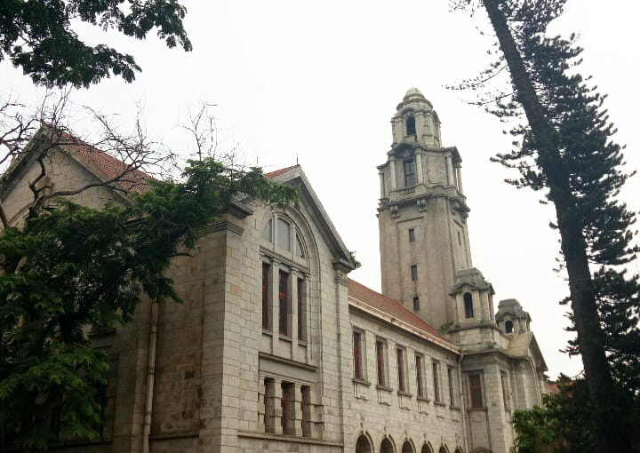
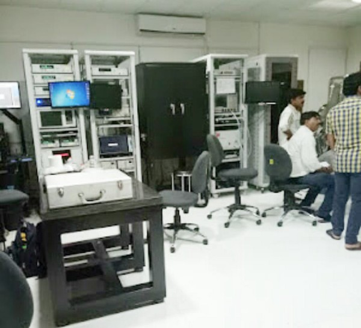

---

title: "My Summer Internship at IISc, Bengaluru"
layout: post
date: 2018-05-05 13:30
tag:
- internship
category: blog
author: atibhi
description: Weekly Blogs

---

This summer I had the opportunity to intern at Department of Electronic Systems Engineering at IISc under Prof. Mayank Srivastava. In this post, I am going to write about my internship experience.

#### MAY
On my first day of internship, I nervously came to the department and was overwhelmed by the size of the labs and buildings. I met my PhD mentor Harsha Ma'am and Abhishek Sir, and they assigned me a problem statement.
My problem statement was to implement the software setup of low frequency noise measurement after understanding the hardware setup.
I couldn't make any sense of it. I would sit quietly in a corner of the lab and read research papers in hopes of understanding a few things. I was scared to ask for help, what if they thought I was dumb and kicked me out ? Slowly, I became friends with the other interns and we started asking doubts to each other. The PhD students of Mayank Sir's lab were very friendly and introduced themselves.
Nanosceinces LabThey gave us a tour of the Nanosciences lab ! Trust me, I felt like I was transported to a different universe. The lab seemed right out of a Sci-Fi movie.
They also told us that we could ask them for help whenever needed. The true learning started after that, I would mail my PhD mentors all my doubts and get instant replies. I now knew that I was free to explore and whatever bumps I ran into, my PhD mentors would be there to help me. With new vigour, I started digging deeper into the topics.

#### JUNE
The month of May passed. Apart from working on my problem statement, I learnt a lot from the people around me.
My friend was working on FINFETs, he and I would discuss about our problem statements. For the months of May and June, all we talked about was Graphene, FINFETs, Low Frequency Noise etc. There was a week when the M.Tech students of IISc had their final presentations, we interns would attend every single one and listen carefully. We would also wander into random departments(where we weren't allowed) and beg the guard to let us see the labs. We actually went to the Animal Facility and learnt about the research being carried out on Monkeys. We also asked every single PhD student to explain what they were working on !
Time was passing, my internship was coming to an end and I still hadn't solved my problem statement. Even though I hadn't solved my problem , I had done a couple of other things.
- Read many research papers.
- Gone through the Semi-Conductor course of Prof. Karmakar.
- Learnt LabView.
- Tried a LOT of libraries, languages and contacted people but failed to implement the software setup.

I was losing hope and there were only two weeks left. My PhD mentor and I were constantly searching for any library that would let us communicate with the instruments. One night at 4 am, I got a mail saying "Have you tried PyVisa ?" from Abhishek Sir.
The next day , I tried and it worked ! :D
But this was just the beginning. The establishing of communication was just a "Hello World! ", most of the major task was left. I started working day and night to finish the code. I had finally understood the solution to the problem. All that was left was coding and implementing it.
The final days consisted of coding and testing. Test, Code and test again. After a lot of modifications, my program was finally running ! I couldn't believe it. I had actually solved the problem statement !
My setup would be used to measure low frequency noise in wafer level devices fabricated by the research group. :)

#### THE PEOPLE

Mayank Sir would play cricket with the other students and interns. He also talked to us like a friend when he took us out for lunch during the last week! If you met him in lab, you wouldn't believe that he is so senior and accomplished. He is very humble. Certainly the coolest professor I've met !
The mentors were also amazing. Once I had fallen sick and had to go to the ER, I called up my mentors to tell them I couldn't come for a few days. They were worried about my well-being and consantly checked up on me. Our mentors also took us to the Hostel Mess !
The other interns, and I have become friends for life. We still keep in touch.
Apart from growing academically, the diverse and brilliant atmosphere of this lab gave me an opportunity to grow as a person. It was an amazing two months, filled with a lot of learning, frustration and happiness.
I will be forever grateful to the magical place called IISc, Prof. Mayank, Harsha Mam and Abhishek Sir for this awesome experience :D

------

*[This blog post was originally published on [Medium](https://medium.com/@atibhiagrawal/my-2018-summer-internship-at-indian-institute-of-sciences-bengaluru-dc804834bde8)]*